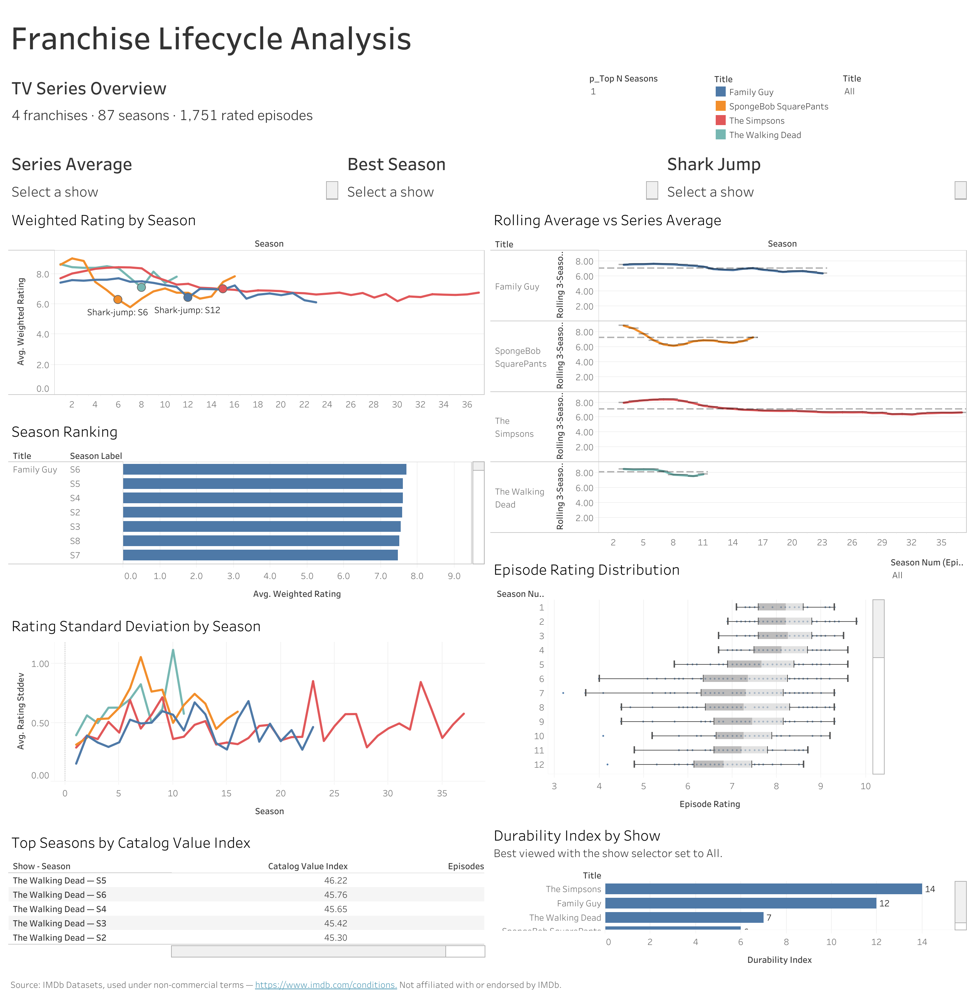

# Franchise Lifecycle Analysis

**When does a long-running television franchise enter sustained ratings decline, and which seasons have the strongest rating-and-engagement profile for licensing or promotion?**

This project models IMDb episode data to identify the first season where each franchise's rolling three-season rating average remains below its own baseline for two consecutive seasons, then ranks seasons using an engagement-weighted Catalog Value Index.

**Status:** Complete — pipeline, SQL model, QA suite, and dashboard all delivered.

| | |
|---|---|
| **Live dashboard** | [Franchise Lifecycle Analysis on Tableau Public](https://public.tableau.com/views/FranchiseLifecycleAnalysis/FranchiseLifecycleAnalysis) |
| **Scope analyzed** | 4 franchises · 87 season rows · 1,751 rated episodes · 3 animated, 1 live-action |
| **Stack** | Python (pandas, NumPy) · DuckDB SQL · Excel via openpyxl · Tableau Public · Git |
| **Latest validation** | 45 of 45 assertions passed across 21 check groups on synthetic fixtures |

## Technical Highlights

- **Python ETL workflow that filters IMDb source data before any SQL or BI tool touches it.** `title.episode` and `title.basics` are read in 500,000-row chunks and filtered per chunk to the four selected shows; `title.ratings` is filtered against the retained episode identifier set. IMDb's `\N` is handled as missing, specials are excluded, and joins use stable `tconst` identifiers rather than title text.
- **Dimensional model in DuckDB** — one show dimension table, one episode fact table, and a season-level aggregate view, with show-level detection results exported separately — three grains, kept distinct downstream.
- **Four business-facing KPIs implemented in SQL** using CTEs, joins, aggregations, and window functions including `RANK()`, `LAG()`, a trailing three-season rolling frame, `STDDEV_SAMP`, and `LOG10`.
- **Automated validation suite** covering schema, range, uniqueness, referential, grain, and cross-file consistency, including a recomputation of the shark-jump result in pandas from the cleaned episode-level CSV as an independent cross-check against the SQL output.
- **Six-tab Excel reconciliation workbook generated with openpyxl**, reconciling season episode counts against the SQL aggregate and independently recomputing a weighted rating from episode-level rows, comparing it with the SQL result at a ±0.01 tolerance.
- **Eight-tile Tableau dashboard** where every analytical metric is precomputed upstream and displayed rather than recalculated, with relationship and grain controls validated by a fan-out test before any tile was built.

## Dashboard

*The default All view shows portfolio-wide counts; the three show-specific KPI cards intentionally prompt "Select a show" until one franchise is selected.*

## Business Framing

Streaming platforms decide which catalog titles to license, renew, or promote under a fixed budget. Because rating performance varies across long-running franchises, season-level analysis gives those decisions a finer unit of prioritization than the show as a whole.

The analysis produces three inputs: the shark-jump season, a sustained-decline signal for closer review; the Catalog Value Index, a rating-and-engagement proxy that ranks seasons into a shortlist; and the Durability Index, which counts seasons whose rolling average is at or above the franchise's baseline. Each is descriptive; no monetary figures appear anywhere in this project.

## Analytical Workflow

    IMDb public TSV datasets: title.episode, title.ratings, title.basics
        |
        v
    1. Python and pandas - extract and transform
       chunked reads, per-chunk filtering, missing-value handling,
       specials exclusion, type conversion, tconst joins, CSV export
        |
        v
    2. DuckDB SQL - model and aggregate
       dim_show, fact_episode, agg_season_kpis view,
       window functions, rolling averages, ranking, KPI calculation
        |
        +---> 3. openpyxl - Excel reconciliation workbook
        |
        +---> 4. qa/validate.py - automated validation and recomputation
        |
        v
    5. Tableau Public - eight-tile decision-support dashboard

## Data Preparation and ETL

`pipeline/01_subset_imdb.py` handles extraction and cleaning. It reads `title.episode` in 500,000-row chunks, keeping only rows whose `parentTconst` matches one of four configured show identifiers, so the source file is never held in memory in full. Those identifiers drive the ratings filter, and `title.basics` is read in chunks against the combined episode and show identifier set.

Cleaning is explicit and logged at each step: specials are removed in two stages (missing season number, then season number zero after casting), rows missing an episode number are dropped, and season and episode numbers cast to integers, ratings to float, votes to integer. An inner join to ratings retains only episodes with usable ratings, and a final step keeps only records typed `tvEpisode` in `title.basics`.

Of 1,869 episode metadata rows for the four shows, 1,751 carried usable ratings and entered the analysis; 118 were excluded for lacking them. Episodes with zero votes are deliberately retained rather than dropped.

## DuckDB Data Model and SQL

The SQL layer builds a minimal star-style dimensional model rather than a conventional multi-dimension star schema.

| Object | Type | Grain |
|---|---|---|
| `dim_show` | table | one row per show, category enrichment joined on `show_tconst` |
| `fact_episode` | table | one row per rated episode in the analytical dataset |
| `agg_season_kpis` | view | one row per show-season, twelve columns |
| `shark_jump_results` | query result exported to CSV | one row per show |
| `durability_index` | query result exported to CSV | one row per show |

| File | Purpose |
|---|---|
| `sql/01_schema.sql` | Builds `dim_show` and `fact_episode` from the cleaned CSVs |
| `sql/02_season_kpis.sql` | Season aggregation, rolling and series averages, ranking, Catalog Value Index |
| `sql/03_shark_jump.sql` | Sustained-decline detection using a rolling window and `LAG()` |
| `sql/04_durability.sql` | Durability Index per show |

Both show-level queries left-join from `dim_show`, so every configured franchise remains represented. A franchise with no shark-jump trigger retains a null detection result, while the Durability Index is returned as a count and coalesced to zero when needed.

## Metric Definitions

**Weighted rating**, per season. Vote weighting prevents a lightly-voted episode from moving a season as much as a heavily-voted one.

    SUM(avg_rating * num_votes) / SUM(num_votes)

**Series average.** The unweighted mean of a show's season-level weighted ratings, used as that show's own baseline.

    AVG(weighted_rating) OVER (PARTITION BY show_tconst)

**Rolling three-season average.** A trailing three-season mean that smooths single-season noise. Seasons 1 and 2 use an expanding window: Season 1 equals its own weighted rating, Season 2 the mean of Seasons 1 and 2.

    AVG(weighted_rating) OVER (PARTITION BY show_tconst ORDER BY season_num
                               ROWS BETWEEN 2 PRECEDING AND CURRENT ROW)

**Shark-jump season.** A rule-based sustained-decline heuristic, not a statistical model. A season is flagged when its rolling three-season average sits below the series average; the shark-jump season is the earliest season flagged alongside the one immediately following. Two consecutive flags separate sustained decline from a single weak season. If no consecutive pair occurs, none is reported — a valid outcome.

**Catalog Value Index**, per season. The base-10 logarithm dampens outlier vote counts so high-volume seasons do not overwhelm the ranking.

    weighted_rating * LOG10(1 + season_total_votes)

**Durability Index**, per show. A count of seasons whose rolling three-season average is at or above the series average.

**Weighted-rating season rank** (`season_rank_best`). A `RANK()` window ordering each show's seasons by weighted rating.

## Verified Findings

| Franchise | Seasons | Rated episodes | Shark-jump | Durability Index |
|---|---:|---:|---:|---:|
| The Simpsons | 37 | 802 | Season 15 | 14 |
| Family Guy | 23 | 446 | Season 12 | 12 |
| SpongeBob SquarePants | 16 | 326 | Season 6 | 6 |
| The Walking Dead | 11 | 177 | Season 8 | 7 |

All four franchises triggered the rule, the earliest at Season 6 and none at Season 1 or 2. The same rule was applied across three animated franchises and one live-action franchise without modification. The Simpsons recorded the highest Durability Index at 14 seasons.

## Dashboard Capabilities

Eight tiles share a single show-selector filter, and the views are driven by generic fields and filters rather than title-specific calculations or hardcoded show names.

| Tile | View | Decision it supports |
|---|---|---|
| 1 | KPI cards and show selector | Franchise, season, and episode counts; series average, best season, and shark-jump season once a show is selected |
| 2 | Weighted rating by season | Season-level rating trajectory with the detected sustained-decline season marked |
| 3 | Rolling average against series average | Smoothed trend relative to the show's baseline, drawn from Season 3 |
| 4 | Season ranking | Seasons ordered by `season_rank_best`, the weighted-rating rank |
| 5 | Episode rating distribution | Spread and consistency within a selected season |
| 6 | Rating standard deviation by season | Within-season episode-rating variability and consistency |
| 7 | Durability Index by show | Cross-franchise comparison |
| 8 | Top seasons by Catalog Value Index | A shortlist sized by an adjustable Top-N parameter, selected on `catalog_value_index` |

Tiles 4 and 8 use different fields: Tile 4 orders one show's seasons by weighted rating, while Tile 8 selects the highest Catalog Value Index seasons from the filtered pool. Episode-grain and season-grain fields are never mixed in one worksheet. Build rules, the relationship model, the fan-out smoke test, and pre-publish gates are documented in the [Tableau dashboard build specification and QA gates](docs/PHASE4_TILE_SPEC_v2.md).

## QA and Validation

`qa/validate.py` runs 21 check groups spanning schema and dtype validation, duplicate keys, null or zero season numbers, value ranges, show membership, title-type correctness, key alignment, row-count parity, show-season uniqueness, per-show grain, and cross-file consistency. Check 11, asserting that every fixture episode identifier carries the synthetic prefix, runs in sample mode only.

The most substantive check recomputes each show's shark-jump season independently in pandas from the cleaned episode-level CSV, applying the same documented series-baseline and expanding-window rules, then compares against the SQL export show by show and reports any disagreement. The latest `--sample --all` run passed 45 of 45 assertions with zero failures and zero warnings.

`pipeline/03_generate_qa_workbook.py` produces a six-tab workbook: `QA_Summary`, `EpisodeCountPivot`, `WeightedRatingCheck`, `DuplicateCheck`, `SharkJumpSanity`, and `VoteCountCheck`. The pivot tab reconciles episode counts against the SQL aggregate; the weighted-rating tab recomputes one season per show from its episode rows and compares against the SQL value within ±0.01. `VoteCountCheck` is manual in full mode, emitting three episodes with IMDb links, and skipped on synthetic fixtures. Generated workbooks contain episode-level rows, so they are gitignored and not distributed here.

## Reproducing the Synthetic Workflow

Committed synthetic fixtures in `data/sample/` let the whole workflow run without downloading IMDb data. The project's Python stack includes `pandas`, `numpy`, `duckdb`, and `openpyxl`. Pandas supports ingestion and transformation, DuckDB powers the SQL analytical model, openpyxl generates the Excel QA workbook, and NumPy supports reproducible seeded synthetic-data generation. Latest local validation passed using Python 3.9.7.

    python pipeline/01_subset_imdb.py --sample
    python pipeline/02_run_sql.py --sample
    python pipeline/03_generate_qa_workbook.py --sample
    python qa/validate.py --sample --all

These are not a strict file-to-file chain: the first exercises the Python preparation stage and writes to `data/sample_out/`, the second reads committed fixtures in `data/sample/` directly, and the workbook generator and Phase 2 checks then read `data/sample_out/`.

In the fixtures, episode identifiers, ratings, vote counts, season structures, and years are fabricated with a seeded generator; the four show titles and series-level `tconst` identifiers are retained as reference metadata so the pipeline exercises real join keys. **Results from `--sample` runs are not analytical findings and do not match the real figures above.**

To run against real data, download `title.episode.tsv.gz`, `title.ratings.tsv.gz`, and `title.basics.tsv.gz` from [IMDb Datasets](https://datasets.imdbws.com/) into `data/raw/` and rerun without `--sample`. Adding another franchise requires a new identifier in the pipeline configuration, a matching row in the category metadata file, a rerun of the Python, SQL, and QA workflow, then refreshing and republishing the Tableau workbook.

## Repository Documentation and Data Policy

    pipeline/     Python ETL, SQL runner, QA workbook generator, configuration
    sql/          Schema, season KPIs, shark-jump detection, durability
    qa/           Automated validation suite
    qa/fixtures/  Seeded synthetic fixture generator
    data/sample/  Committed synthetic fixtures
    excel/        Workbook output location; generated workbooks are gitignored
    screenshots/  Dashboard image
    docs/         Project specification and Tableau build specification

To respect IMDb's dataset terms, this repository contains no raw IMDb TSV files, no real row-level IMDb-derived CSV outputs, no Tableau workbooks or extracts, and no generated Excel workbooks. The committed fixtures in `data/sample/` are row-level but generated, not real IMDb episode records. Published material is code, synthetic fixtures, documentation, aggregate results, and the dashboard image.

## Interpretation and Limitations

**This analysis measures when and how much franchise ratings changed. It does not establish why.** A detected shark-jump season marks where a rule based on rolling averages first triggers; it is not evidence of a cause. Where a real-world event coincides with a detected season, that is a correlation unless established independently — outside this project's scope.

- IMDb ratings come from self-selected voters, not a representative sample of viewers.
- Vote counts skew toward popular and recent titles, affecting the Catalog Value Index; it is an engagement-weighted quality proxy, not a measure of audience size or commercial performance.
- 118 episodes lacking usable ratings were excluded, so sparsely covered seasons rest on fewer observations.
- The detection rule is a simple heuristic; different window or threshold choices could move the reported season.
- The series baseline is the unweighted mean of season-level weighted ratings, so each season counts equally regardless of episode count.
- Ratings are a snapshot from download time and continue to change.
- Four franchises are not a representative sample of television; these findings describe the analyzed set only.
- Neither causal explanations nor financial conclusions are drawn.

## Data Source and Attribution

Information courtesy of IMDb (https://www.imdb.com). Used with permission.

Data comes from the [IMDb Datasets](https://datasets.imdbws.com/) under IMDb's non-commercial terms. See the [IMDb Conditions of Use](https://www.imdb.com/conditions).

This is an independent portfolio project, not affiliated with, endorsed by, or sponsored by IMDb. No data was scraped; only IMDb's published datasets were used.
